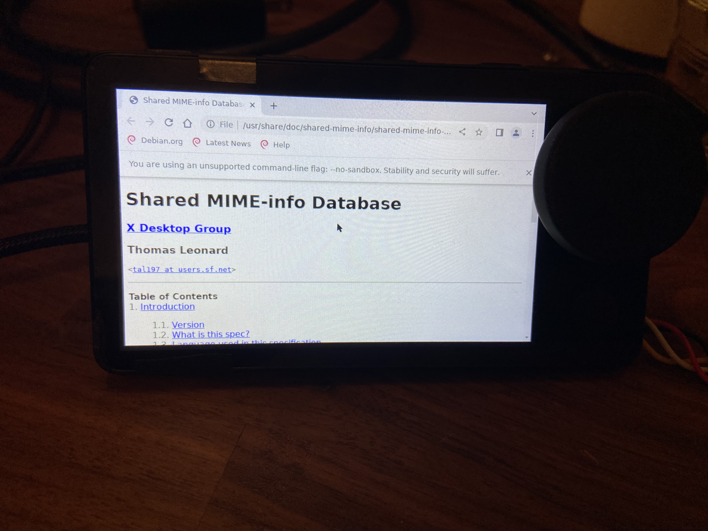

# Superbird (Spotify Car Thing) Debian Chroot

Create a debian chroot as an image file on data partition.

The chroot includes X11 and chromium.

## Progress

This project is just a starting point, and is not particularly useful as-is

* working: X11 display using framebuffer driver
* not working: touch, buttons, knob, audio, network, basically anything else

## Usage

1. Before using this, you need to follow the [instructions here](https://github.com/frederic/superbird-bulkcmd) to setup your device to always boot in usb burning mode. 
2. After that, power on your device and run `./boot-adb-kernel.sh` to boot up with adb enabled.
   1. this change is not persistent
3. Verify adb is working: `adb devices` should give you `123456	device`
   1. It takes a few seconds to become available, be patient
4. Run `build.sh` which will:
   1. create `debian-filesystem.img` with a minimal debian root filesystem, plus some packages as defined in `multistrap.conf`. 
   2. Will copy `xorg.conf` into the image at `/etc/X11/xorg.conf`.
5. Run `deploy.sh` which will:
   1. use adb to push `debian-filesystem.img` to `/var/debian-filesystem.img` on the device
   2. copy everything in `scripts/` to `/scripts/` on device.
   3. if you run `./deploy.sh -s` it will only push the scripts to the device.
6. Open shell on device: `adb shell`
7. Before activating the chroot, you should probably stop the superbird app: `/etc/init.d/S95supervisord stop`
   1. if you want to disable it persistently: `mv /etc/init.d/S95supervisord /etc/init.d/K95supervisord`
8. You can activate the chroot (on device) using `/scripts/activate-chroot.sh`
   1. will also remount `/` as read/write
9.  Once chroot is activated, try launching chromium: `xinit /usr/bin/chromium --no-sandbox`
    1.  you need `--no-sandbox` because running as root
10. Profit?
11. To deactivate the chroot, just `exit`
    1.  will automatically call `/scripts/cleanup-chroot.sh` to unmount everything
    2.  if you ever end up in a situation where the chroot was not cleaned up properly, just run `/scripts/cleanup-chroot.sh` manually

The image file is sized at 1.75GB, leaving about 200MB spare on the data partition.
The current list of packages only occupy about 755MB of that, so there is plenty room for more.

## Device Scripts

The scripts in `device-scripts/` will be pushed to the device at `/scripts/`
* `activate-chroot.sh` mount all the things and activate the chroot
* `cleanup-chroot.sh` clean up all the mounts from the chroot

## Other files

Some files originate from [frederic's repo](https://github.com/frederic/superbird-bulkcmd):

* `amlogic-usb-tool` is just `bin/update` renamed for clarity
* `images/*` are all from that repo. Only `env.txt` has been modified for readability
* `set-bootargs.sh` is a modified version of `scripts/uart-shell.sh`
  * The only changes I made were to abstract variables, and check OS/arch
  * You do not need this unless you have the serial console connected and want to see boot messages there
* `boot-adb-kernel.sh` is a modified version of `scripts/upload-kernel.sh`
  * Aside from abstracting some vars, the only real change I made was to remove newline characters from `env.txt`; newlines make it easier to read and edit, but they must be stripped before being sent to the device
